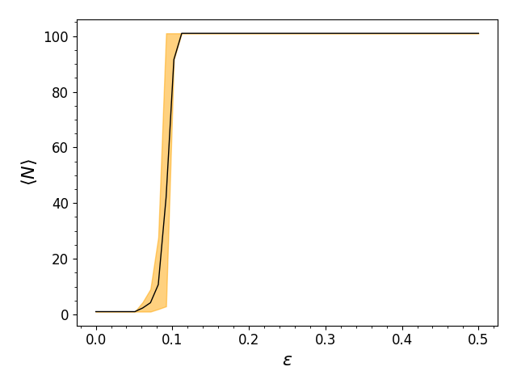

## CRyd Ercolation

### Code ptimization
Timer unit: 1e-06 s

Total time: 3.7897 s
File: percolation.pyx
Function: run at line 37

Line #      Hits         Time  Per Hit   % Time  Line Contents
==============================================================
    37                                           def run(np.ndarray S, float eps):
    38                                             """Does the simulation.
    39                                             
    40                                             Args
    41                                             ----
    42                                               S : np.array or memoryview
    43                                                 the array of points (as a memoryview).
    44                                               eps: float
    45                                                 the radius of the ball
    46                                             """
    47                                           
    48         1          3.0      3.0      0.0    cdef unsigned int N = len(S)
    49                                             cdef unsigned int i,j, new_excited_index
    50                                             
    51         1         10.0     10.0      0.0    set_time_seed()
    52                                           
    53         1          1.0      1.0      0.0    excited = [] # The indexes of excited atoms
    54                                           
    55                                             # Start with a random excited atom
    56         1          2.0      2.0      0.0    excited.append(rand()%N)
    57                                           
    58                                             # Given a list of excited atoms
    59                                             # Finds the index of every reachable atom
    60         1          1.0      1.0      0.0    reachable = []
    61         1          1.0      1.0      0.0    cdef int M = 0
    62         1          1.0      1.0      0.0    while M < 100:
    63       100         43.0      0.4      0.0      for i in range(len(excited)):
    64      5050       2254.0      0.4      0.1        for j in range(N):
    65    505000     466471.0      0.9     12.3          if j not in excited:
    66    166650    3270351.0     19.6     86.3            if dist(S[excited[i]], S[j]) <= eps:
    67     50732      48134.0      0.9      1.3              if j not in reachable:
    68      4490       2118.0      0.5      0.1                reachable.append(j)
    69                                           
    70       100         48.0      0.5      0.0      if len(reachable) == 0:
    71                                                 # print("no reachable elements")
    72         1          0.0      0.0      0.0        break
    73                                               else:
    74                                                 # print(f"iteration {M}")
    75                                                 # print(f"reachable = {reachable}")
    76                                                 # print(f"excited = {excited}")
    77                                                 # Selects a reachable atom and exites it
    78                                           
    79        99         68.0      0.7      0.0        new_excited_index = rand()%len(reachable)
    80        99         55.0      0.6      0.0        excited.append(reachable[new_excited_index])
    81                                                 """Here the algorithm must be revised, 
    82                                                 since fusing the balls means that all the reachable 
    83                                                 points at this iteration will be rachable in the next one.
    84                                                 
    85                                                 A lot of computing power is wasted trashing everything."""
    86        99         95.0      1.0      0.0        reachable = []    
    87        99         42.0      0.4      0.0      M +=1 
    88         1          1.0      1.0      0.0    return excited

  
  # Alg opt
  [Cell List](https://en.wikipedia.org/wiki/Cell_lists)
