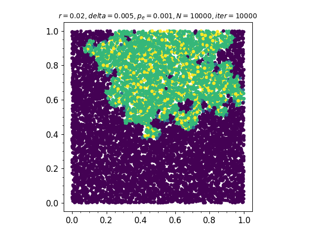
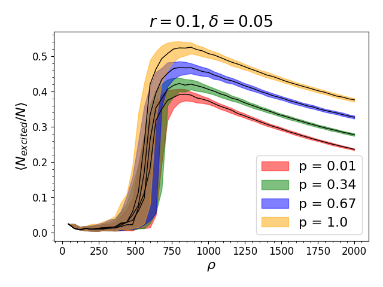
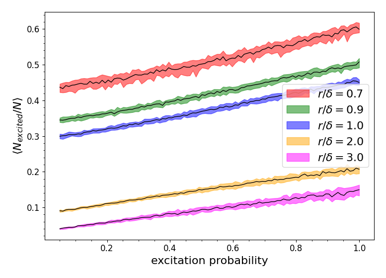

## fRyd Ercolation

Numerical simulation of the facilitation process of Rydberg atoms.





### Requirements and installation
`pipenv` is required.

To activate the environment run

```
pipenv install
pipenv shell
```

then in the environment run

```
make
```

to compile the cython code.

Other compilation methods: 
- `make profile` for profiling
- `make hardcore` for speedup
- `make hardcoreprofile` for profiling and speedup


