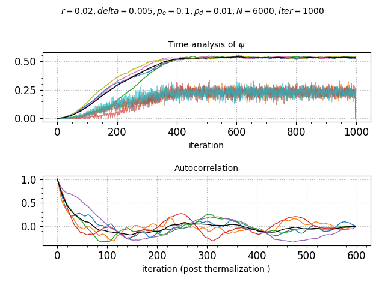
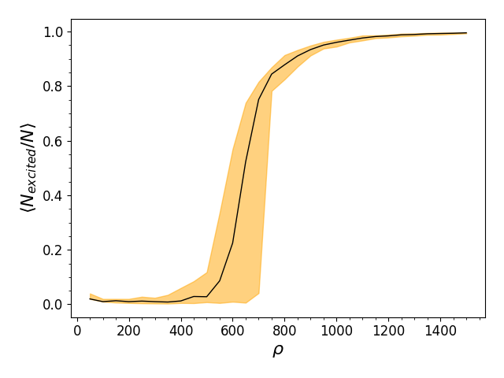

## CRyd Ercolation

Numerical simulation of the avalanche process of Rydberg atom exitation through percolation.

The aim is to simulate ~10^6 (steady) atoms. The simulation requires to compute repeatedly a fixed-radius near neighbor list.
Due to the high number of particles a "distances look-up table" strategy cannot be pursued since the matrix itself would occupy 10^12 * 4 bytes = 4 TB of memory.

